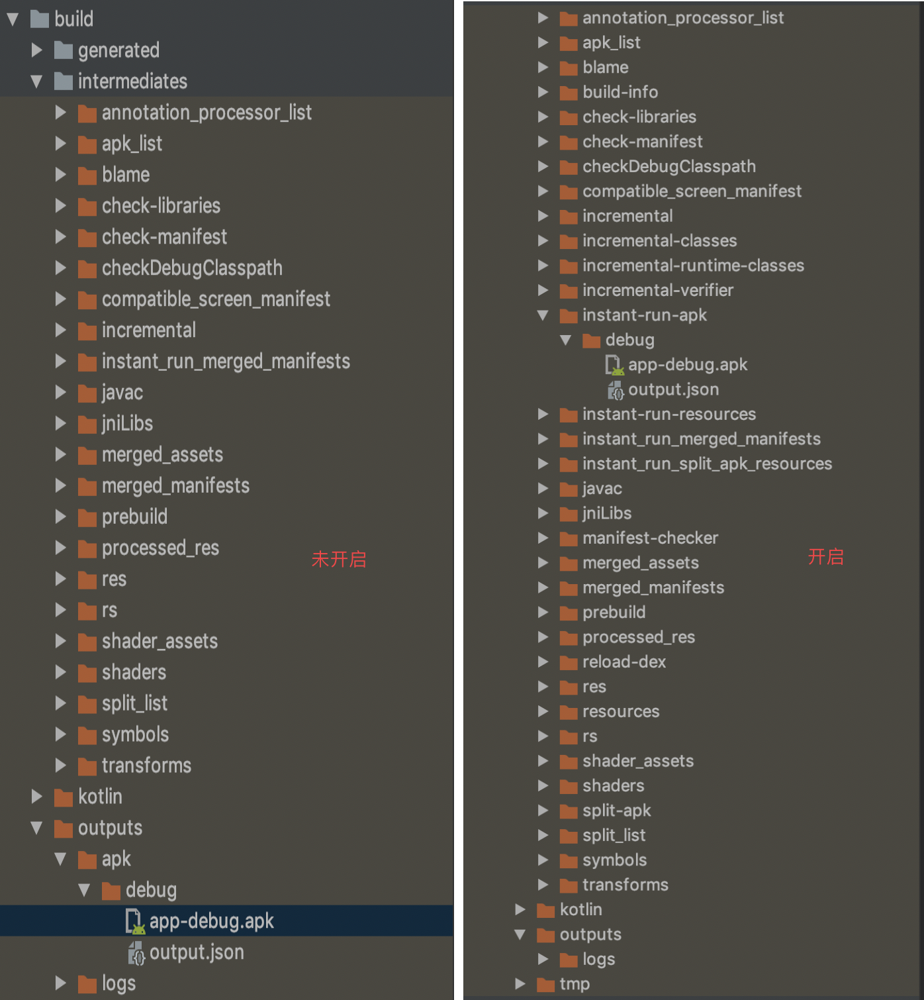
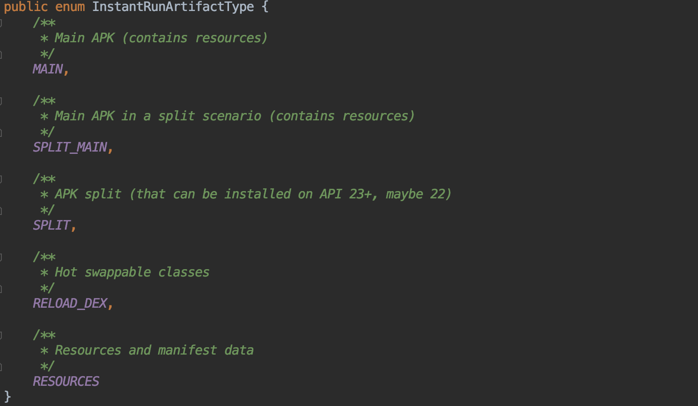
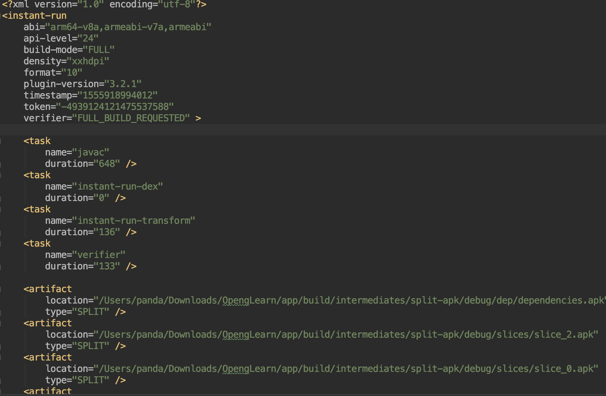
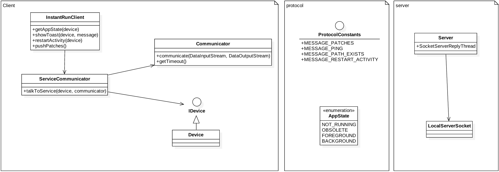
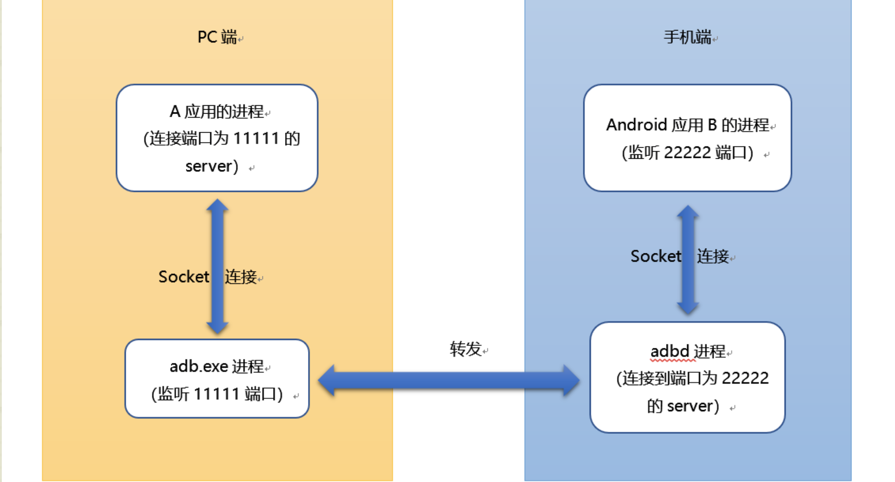
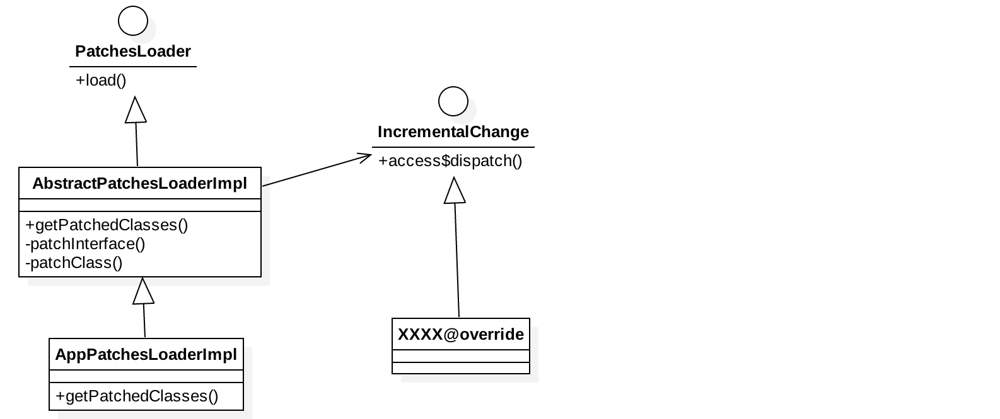
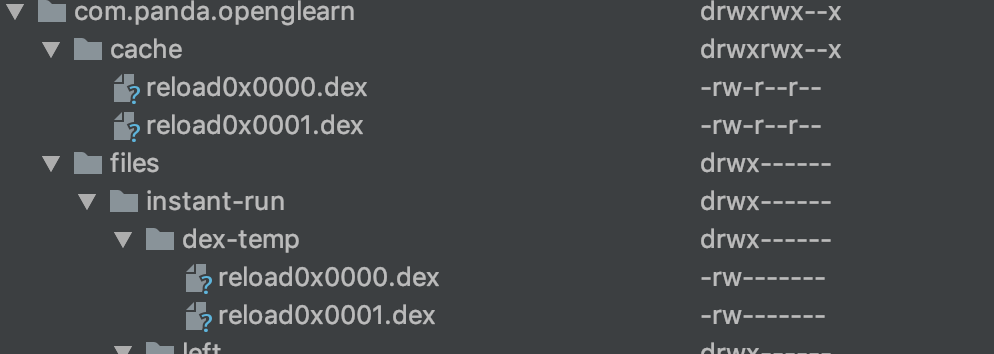
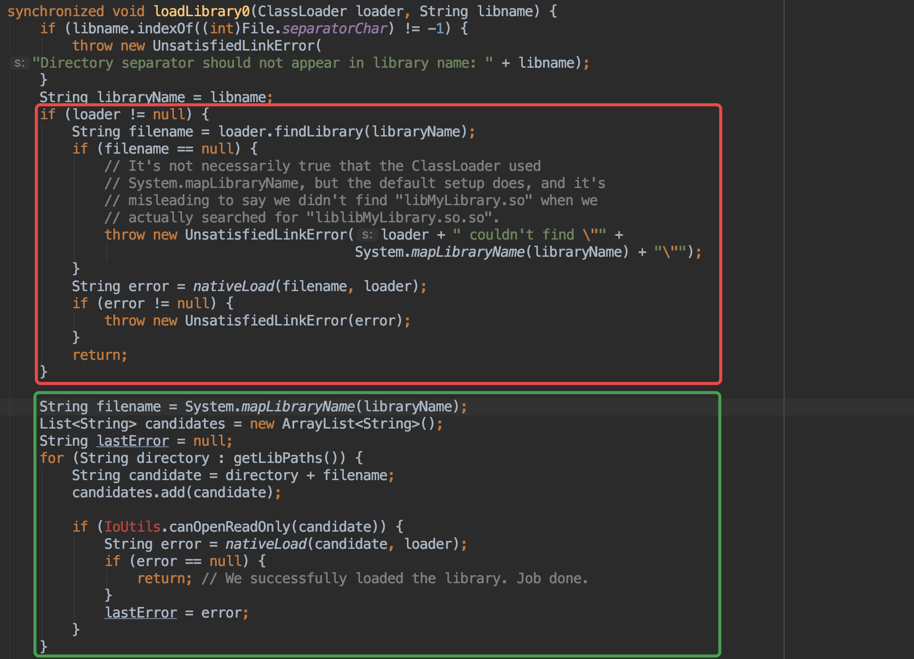

# Instant run分析

> 源码基于：https://android.googlesource.com/platform/tools/base/+/refs/tags/gradle_3.1.2

## 总体介绍

Instant Run的代码结构：

* **instant-run-annotations**：注解，标记不是用instant-run
* **instant-run-client**：解析build-info.xml，确定部署类型，保持和手机的通信
* **instant-run-common**：在C/S两端都会使用到的类，主要是通信协议
* **instant-run-runtime**：在server端的运行时
* **instant-run-server**：保持和AS的通信，部署新的代码逻辑

我们看下不开启和开启InstantRun后build下的差异：


两者的差异还是很大的，不开启的时候，完整的apk包就在`/outputs/apk/`下；开启后，就没有完整apk的概念了，代码被打散了，`/instant-run-apk/apk/`下的apk只是个脚手架，不包含项目的代码，它里面只有Instant Run的代码，而项目代码放在了`/split-apk/debug/slices/`下。

Instant Run的安装也和正常的安装不同：

```c
adb install-multiple -r -t /Users/panda/Downloads/OpengLearn/app/build/intermediates/split-apk/debug/dep/dependencies.apk /Users/panda/Downloads/OpengLearn/app/build/intermediates/split-apk/debug/slices/slice_2.apk /Users/panda/Downloads/OpengLearn/app/build/intermediates/split-apk/debug/slices/slice_0.apk /Users/panda/Downloads/OpengLearn/app/build/intermediates/split-apk/debug/slices/slice_1.apk /Users/panda/Downloads/OpengLearn/app/build/intermediates/split-apk/debug/slices/slice_4.apk /Users/panda/Downloads/OpengLearn/app/build/intermediates/split-apk/debug/slices/slice_3.apk /Users/panda/Downloads/OpengLearn/app/build/intermediates/split-apk/debug/slices/slice_5.apk /Users/panda/Downloads/OpengLearn/app/build/intermediates/split-apk/debug/slices/slice_9.apk /Users/panda/Downloads/OpengLearn/app/build/intermediates/split-apk/debug/slices/slice_6.apk /Users/panda/Downloads/OpengLearn/app/build/intermediates/split-apk/debug/slices/slice_7.apk /Users/panda/Downloads/OpengLearn/app/build/intermediates/split-apk/debug/slices/slice_8.apk /Users/panda/Downloads/OpengLearn/app/build/intermediates/instant-run-apk/debug/app-debug.apk
```

instant run的编译流程如下：


这里使我们对Instant Run的一个大体的了解，下面我们进入代码详细了解Instant Run。

## UpdateMode模式

Instant Run对于app的部署有如下几种模式：

* **NO_CHANGES**：没任何变化，不需要更新
* **HOT_SWAP**：热部署，无需重启APP和Activity
* **WARM_SWAP**：温部署，APP无需重启，但当前activity需要重启
* **COLD_SWAP**：冷部署，APP重启

> 那UpdateMode是怎么确定的呢？

关键内容：

* build-info.xml
* InstantRunArtifactType.java
* InstantRunBuildInfo.java
* InstantRunVerifierStatus.java

`InstantRunArtifactType`枚举类，定义热更部署的类型：


`InstantRunVerifierStatus`是另外一个枚举类，指示变更的类别，比如新加了个class、资源修改、方法内容变更等：

```java
public enum InstantRunVerifierStatus {
    // changes are compatible with current InstantRun features.
    COMPATIBLE,
    // the verifier did not run successfully.
    NOT_RUN,
    // InstantRun disabled on element like a method, class or package.
    INSTANT_RUN_DISABLED,
    // Any inability to run the verifier on a file will be tagged as such
    INSTANT_RUN_FAILURE,
    // A new class was added.
    CLASS_ADDED,
    // changes in the hierarchy
    PARENT_CLASS_CHANGED,
    IMPLEMENTED_INTERFACES_CHANGE,
    // class related changes.
    CLASS_ANNOTATION_CHANGE,
    STATIC_INITIALIZER_CHANGE,
    // changes in constructors,
    CONSTRUCTOR_SIGNATURE_CHANGE,
    // changes in method
    METHOD_SIGNATURE_CHANGE,
    METHOD_ANNOTATION_CHANGE,
    METHOD_DELETED,
    METHOD_ADDED,
    // changes in fields.
    FIELD_ADDED,
    FIELD_REMOVED,
    // change of field type or kind (static | instance)
    FIELD_TYPE_CHANGE,
    R_CLASS_CHANGE,
    // reflection use
    REFLECTION_USED,
    JAVA_RESOURCES_CHANGED,
    DEPENDENCY_CHANGED,
    // the binary manifest file changed, probably due to references to resources which ID changed
    // since last build.
    BINARY_MANIFEST_FILE_CHANGE
}
```

最后重要的是`build-info.xml`文件，它是gradle自动生成的，不需要我们自己去编辑修改，它的解析是由`com.android.tools.ir.client.InstantRunBuildInfo`完成的。


> 具体的解析与实施

我们从`InstantRunClient.pushPatches()`开始看。

```java
public UpdateMode pushPatches(@NonNull IDevice device,
            @NonNull final InstantRunBuildInfo buildInfo,
            @NonNull UpdateMode updateMode,
            final boolean isRestartActivity,
            final boolean isShowToastEnabled) 
```

这里的`buildInfo`就是通过解析`build-info.xml`得来的。**这里传进来的updateMode我猜测应该是`HOT_SWAP`。**


就是如果不做热部署，则将updateMode的值换成`COLD_SWAP`。


如果有资源更新，则将updateMode的值换成`WARM_SWAP`。


如果没有任何变化，则将updateMode的值换成`NO_CHANGES`。

## 运行时与通信

这里的通信是个什么概念呢？

**patchs的逻辑是由`instant-run-client`在Android Studio里完成的，`instant-run-client`的代码是不打入patch包里的，所以需要通信告诉手机需要做什么类型的部署。**

Instant-Run的通信是采用LocalSocket完成的。具体代码不详细分析了，其实就是socket通信，我们看下架构图：


有几个关键的知识点：

> 1、IDevice.java

这个类是有啥用呢？它不是InstantRun里的类，它是ddmlib里的一个通信类。它是在`ServiceCommunicator`里使用的。


主要是`createForward()` 和 `removeForward()`。IDevice类也只是个接口，接收端口号、远程socket名（这里是包名），真实做事情的是`AdbHelper.java`，在createForward()里它的逻辑是：

```java
public static void createForward(InetSocketAddress adbSockAddr, Device device,
            String localPortSpec, String remotePortSpec)
                    throws TimeoutException, AdbCommandRejectedException, IOException {
        SocketChannel adbChan = null;
        try {
            adbChan = SocketChannel.open(adbSockAddr);
            adbChan.configureBlocking(false);
            byte[] request = formAdbRequest(String.format(
                    "host-serial:%1$s:forward:%2$s;%3$s", //$NON-NLS-1$
                    device.getSerialNumber(), localPortSpec, remotePortSpec));
            write(adbChan, request);
            AdbResponse resp = readAdbResponse(adbChan, false /* readDiagString */);
            if (!resp.okay) {
                Log.w("create-forward", "Error creating forward: " + resp.message);
                throw new AdbCommandRejectedException(resp.message);
            }
        } finally {
            if (adbChan != null) {
                adbChan.close();
            }
        }
    }
```

代码的细节不用太关心，其实就是2个核心的adb命令：

```c
host-serial:%1$s:forward:%2$s;%3$s
host-serial:%1$s:killforward:%2$s
```

其实就是执行端口转发，转发电脑的XXX端口的数据到手机的XXX端口上，从而来端建立ServerSocket监听。它的效果可以用一张图表示：


这里用到了adb协议中的`host-serial`，关于adb的文章可以看下我之前写的[ADB通信协议](ADB通信协议.md)。

端口转发后，就通过Socket建立通信通道，不再使用的时候就killforward。

> 2、server服务的启动

server服务的启动应该是越早越好，那能否比Application还早呢？

可以的！使用ContentProvider，ContentProvider的onCreate()是早于Application的onCreate()。这个设计到安卓进程的启动。我们看看InstantRun的做法：

```java
public final class InstantRunContentProvider extends ContentProvider {

    @Override
    public boolean onCreate() {
        if (isMainProcess()) {
            Log.i(Logging.LOG_TAG, "starting instant run server: is main process");
            Server.create(getContext());
        } else {
            Log.i(Logging.LOG_TAG, "not starting instant run server: not main process");
        }
        return true;
    }
    ... ...
}
```
## 通信服务

InstantRun提供了多个服务，协议定义是在`ProtocolConstants.java`：

### `MESSAGE_PING`

获取app的状态，具体定义在`AppState.java`里。这里有段很好的工具代码，可以在任何地方判断出activity是前台还是后台。具体代码看`com/android/tools/ir/server/Restarter/getActivities()`，大概逻辑：


### `MESSAGE_SHOW_TOAST`

显示toast，用来提示是热部署的。

### `MESSAGE_RESTART_ACTIVITY`

重新启动activity，核心代码在`com/android/tools/ir/server/Restarter/restartActivity()`

```java
private static void restartActivity(@NonNull Activity activity) {
    if (Log.isLoggable(LOG_TAG, Log.VERBOSE)) {
        Log.v(LOG_TAG, "About to restart " + activity.getClass().getSimpleName());
    }

    // You can't restart activities that have parents: find the top-most activity
    while (activity.getParent() != null) {
        if (Log.isLoggable(LOG_TAG, Log.VERBOSE)) {
            Log.v(
                    LOG_TAG,
                    activity.getClass().getSimpleName()
                            + " is not a top level activity; restarting "
                            + activity.getParent().getClass().getSimpleName()
                            + " instead");
        }
        activity = activity.getParent();
    }

    // Directly supported by the framework!
    activity.recreate();
}
```

这里有个while循环，这个是早期android activity的嵌套逻辑，现在都已经废弃了，用Fragemnt代替，随意这里的while逻辑一般不会走到。

### `MESSAGE_PATCHES`

发送patch包，进行部署。


核心的方法：

* hasResources()：判断是否有资源更新
* handlePatches()：处理patch，主要是读取然后写文件
* restart()：最后的处理

#### 1、hasResources()

具体代码：

```java
private static boolean isResourcePath(String path) {
    return path.equals(RESOURCE_FILE_NAME) || path.startsWith("res/");
}

private static boolean hasResources(@NonNull List<ApplicationPatch> changes) {
    for (ApplicationPatch change : changes) {
        String path = change.getPath();
        if (isResourcePath(path)) {
            return true;
        }

    }
    return false;
}
```

当我们更新res资源的时候（注意是仅更新res），`build-info.xml`里会有一行记录：


从这里可以知道有没有资源的更新。

#### 2、handlePatches()

核心的代码是：


> handleHotSwapPatch()

热部署代码修改，主要是方法内部的修改情况。

当我们更改某个方法时，`build-info.xml`里会有一行记录：


这里涉及到class的热更新，看后面的分析。

> handleResourcePatch()

这段代码的核心就是将资源写入到磁盘上，为了后面的加载。

```java
public static void writeAaptResources(@NonNull String relativePath, @NonNull byte[] bytes) {
    File resourceFile = getResourceFile(getWriteFolder(false));
    File file = resourceFile;
    if (USE_EXTRACTED_RESOURCES) {
        file = new File(file, relativePath);
    }
    File folder = file.getParentFile();
    if (!folder.isDirectory()) {
        boolean created = folder.mkdirs();
        if (!created) {
            if (Log.isLoggable(Logging.LOG_TAG, Log.VERBOSE)) {
                Log.v(Logging.LOG_TAG, "Cannot create local resource file directory " + folder);
            }
            return;
        }
    }

    if (relativePath.equals(RESOURCE_FILE_NAME)) {
        //noinspection ConstantConditions
        if (USE_EXTRACTED_RESOURCES) {
            extractZip(resourceFile, bytes);
        } else {
            writeRawBytes(file, bytes);
        }
    } else {
        writeRawBytes(file, bytes);
    }
}
```

磁盘上的路径是：`/data/data/${applicationId}/files/instant-run`

具体会放在`left`或`right`文件夹下，这2个文件夹是彼此切换的，这次是写到left，那么下次就会写到right下。**目的是区分开来读写。**


#### 3、restart()

实施部署。

1. 如果是无更新或者热更新，则直接弹出个toast提示，return;
2. 如果有资源的更新，并且是温部署，则进行资源的热更新，具体的代码分析在后面
3. 如果是温部署，则要重启当前的activity，这里系统给了我们2种方式来重启activity。
 * 自己实现`onHandleCodeChange`，在这里自己完成重启的逻辑
 * 调用`Restarter.restartActivityOnUiThread()`，它其实就是去调用Activity的recreate() 
4. 如果冷启动，则需要重启app了，也有2种方式（默认是第二种）：
 *  调用`Restarter.restartApp()`
 *  等待IDE去重启

### `MESSAGE_EOF`

当次通信结束信号。

## 热部署的深入分析

我们将从Instant-Run入手，分辨从Class、资源、SO库几个方面来看Instant-Run如何完成热部署的，然后会对比再看看其他一些方案。

## Class

### Class的替换

Instant Run的核心代码是在`Server`里的`handleHotSwapPatch()`方法。

涉及到的核心类：

* **IncrementalChange**：runtime模块中
* **PatchesLoader**：runtime模块中
* **AbstractPatchesLoaderImpl**：runtime模块中
* **AppPatchesLoaderImpl**：AMS字节码生成
* **XXXX@override（XXXX是修改的类）**：AMS字节码生成

类之间的关系：



首先会将patch包资源写入到磁盘，然后通过DexClassLoader去装载该路径下的资源。


这里的写入的路径是：

没产生一次`RELOAD_DEX`就会有一个新的dex。

我们需要知道一个核心点：**Instant Run采用了ASM字节码的方式来做代码内部的修改变化记录。**

当你修改某个class下的方法内的代码时，执行Instant Run后，我们看下`/build/transforms/`下：


整体的逻辑：**在每个类实例中插入一个IncrementalChange类型的`$change`字段，每个方法前插入一段判断逻辑，如果`$change`不为null，就把方法调用重定向到`$change`的对应方法上。**

比如有这样一个类`Test.java`：

```java
public class Test {
    public int add(int i, int j) {
        return i + j;
    }
}
```

经过Instant Run的编译：

```java
public class Test {
    public static final long serialVersionUID = -5742936398683071894L;

    public Test() {
        IncrementalChange var1 = $change;
        if (var1 != null) {
            Object[] var10001 = (Object[])var1.access$dispatch("init$args.([Lcom/panda/openglearn/Test;[Ljava/lang/Object;)Ljava/lang/Object;", new Object[]{null, new Object[0]});
            Object[] var2 = (Object[])var10001[0];
            this(var10001, (InstantReloadException)null);
            var2[0] = this;
            var1.access$dispatch("init$body.(Lcom/panda/openglearn/Test;[Ljava/lang/Object;)V", var2);
        } else {
            super();
        }
    }

    public int add(int i, int j) {
        IncrementalChange var3 = $change;
        return var3 != null ? ((Number)var3.access$dispatch("add.(II)I", new Object[]{this, new Integer(i), new Integer(j)})).intValue() : i + j * 2;
    }

    Test(Object[] var1, InstantReloadException var2) {
        String var3 = (String)var1[1];
        switch(var3.hashCode()) {
        case -1968665286:
            super();
            return;
        case -846833282:
            this();
            return;
        default:
            throw new InstantReloadException(String.format("String switch could not find '%s' with hashcode %s in %s", var3, var3.hashCode(), "com/panda/openglearn/Test"));
        }
    }
}
```

如果修改其中的方法，那么在transforms的InstantRun下，会多出个`Test$override.java`：

```java
public class Test$override implements IncrementalChange {
    public Test$override() {
    }

    public static Object init$args(Test[] var0, Object[] var1) {
        Object[] var2 = new Object[]{new Object[]{var0, new Object[0]}, "java/lang/Object.()V"};
        return var2;
    }

    public static void init$body(Test $this, Object[] var1) {
    }

    public static int add(Test $this, int i, int j) {
        return i + j * 2;
    }

    public Object access$dispatch(String var1, Object... var2) {
        switch(var1.hashCode()) {
        case -1129866501:
            return new Integer(add((Test)var2[0], ((Number)var2[1]).intValue(), ((Number)var2[2]).intValue()));
        case 1801359502:
            return init$args((Test[])var2[0], (Object[])var2[1]);
        case 2072146884:
            init$body((Test)var2[0], (Object[])var2[1]);
            return null;
        default:
            throw new InstantReloadException(String.format("String switch could not find '%s' with hashcode %s in %s", var1, var1.hashCode(), "com/panda/openglearn/Test"));
        }
    }
}
```

同时会有个`AppPatchesLoaderImpl.java`类：

```java
public class AppPatchesLoaderImpl extends AbstractPatchesLoaderImpl {
    public static final long BUILD_ID = 1556531750890L;

    public AppPatchesLoaderImpl() {
    }

    public String[] getPatchedClasses() {
        return new String[]{"com.panda.openglearn.Test"};
    }
}
```

现在我们再看看是如何解析的？

第一步：加载`AppPatchesLoaderImpl`

```java
Class<?> aClass = Class.forName("com.android.tools.ir.runtime.AppPatchesLoaderImpl", true, dexClassLoader);
```

第二步：解析其中的修改类

其实就是读取所有的`getPatchedClasses()`类，然后反射加载进来。这个具体的代码逻辑看`com/android/tools/ir/runtime/AbstractPatchesLoaderImpl.java`

我们用一个图来说明这中间发生的流程：


> 为什么要这么复杂？

上面的代码分析起来其实很简单，其实就是通过ASM插入了新的代码模块，然后通过运行时反射代理掉老的代码块。但是代码实现上还是相当复杂的，就ASM生成代码桩和`$override`代码就很复杂了。

直接加载修改类可不可以呢？肯定是不行的，原因如下：

* 同一个类不能被reload
* 判定两个类相同不仅要fully qualified name相同，而且class loader也必须同一个，否则会有ClassCastException

基于此：当XXX的实现变了的话无法实时更新，但是更新辅助类`XXX$override`就没有问题，因为`XXX$override`都实现了IncrementalChange接口，所以使用新的classLoader去加载更新后的`XXX$override`实例并赋值给`$change`是没有问题的。这也是一种代理。

> 缺陷

这种方式的热更新的缺陷是只能支持方法内的修改，而对于：

* 添加方法
* 删除方法
* 添加类
* 删除类
* 更改继承关系
* 更改关联关系
* 增加属性
* 删除属性
* ... ...

则无法做到温部署了，也就不能使用到上面的那套逻辑。

### Instant Run的自我解决方案

对于增加/删除资源，以及上面说的Class温部署的缺陷，Instant Run采用了COLD_SWAP方式，就是重启app加载。

我们看下当我们增加一个方法时，build-info.xml里的变化：


其实就是类似添加方法的操作，都是冷部署`COLD_SWAP`的方式来使得修改生效。

### 其他的解决方案

目前市面上解决类补丁生效的方式基本上有2种：

* Classloader重新加载。缺陷是需要重启，否则无法加载新类。典型的代表者是Tinker
* 在原来类的基础上做直接Native替换方法。不需要重启。典型的代表者是AndFix

关于AndFix的分析可以看之前的文章[AndFix源码阅读随笔](AndFix源码阅读随笔.md)。


## 资源

### 资源的加载

核心代码`MonkeyPatcher`里`monkeyPatchExistingResources()`：

```java
public static void monkeyPatchExistingResources(
	@Nullable Context context,
    @Nullable String externalResourceFile,
    @Nullable Collection<Activity> activities)
```

核心就2步：

* 创建一个新的AssetManager，通过反射的方式调用到addAsserPath，把包含**完整的**新的资源包加入到AssetManager里
* 找到所有引用AssetManager的地方，通过反射的方式将引用的AssetManager对象全部换成新的，如：
 * Resources对象
 * Resources.Theme对象
 * ContextThemeWrapper对象
 * ResourcesManager对象
 * ActivityThread对象

通过源码可以看出，主要的工作是找到所有AssetManager的引用出，做好兼容性处理。

> addAssetPath()

这个方法整个调用逻辑很复杂，核心是解析传入的资源包，得到其中的resources.arsc，最后存入到AssetManager的ResTable里，ResTable是个结构体，存储解析后的资源信息。


**新的sdk里，addAssetPath()方法已经被标记为Deprecated了，说不定在后续的版本中会被移除。新的方法是addAssetPathInternal()。native层的代码逻辑也有很大的改动，需要注意这块~**

> 查看apk下的资源情况的命令

```
aapt d resources XXX.apk
``` 

### 资源的解析

aapt打出来的包，其资源的package id为0x7f，而系统的资源包，framework-res.jar里的资源package id为0x01。

原始的apk的资源加载是在app启动的时候，由`ActivityThread.ApplicationThread.handleBindApplication()`到`LoadedApk.getResources()`，感兴趣的可以源码阅读下这个流程。

### 缺陷的优化思路

Instant Run的资源更新是需要整包更新的，就是必须是一个包含原始资源和修改资源的整个的一个大包，一次性更新到AssetManager里。

但是我们不能下发那么大的资源包下来啊。

解决方案：

* bsdiff对资源包做差分，下发差量包，本地合成
* 修改aapt大包工具，对资源包重新编号
* 构造独特的package id的更新资源包

#### 1、bsdiff差分

这个方案是我觉得比较简单的也挺好的一个方案。理解容易，操作简单，唯一的就是需要在运行时再本地合成。

#### 2、aapt工具包

这个工作量最大，对开发人员要求很高，而且需要做好后续aapt版本的兼容性工作，不推荐。

#### 3、package id

类似差分包概念，就是每次下去的布丁包的package id是特别定义的。这样在本地不需要做merge的操作，直接加入到已有的AssetManager中就可以了。

**_阿里的热更新就是这么做的。_**

补丁包里的资源，包括3种状态：新增、修改、删除。

用一张图表示这种状态的装换关系：


该方案的难点在于patch的生成，需要通过比较新旧两个包里的resources.arsc，找出不同，生成带有新package id的资源包。这需要对resources.arsc十分熟悉，对立面的每个chunk逐个的进行解析。

> TIPS

Instant Run存在很多的反射，其实是为了兼容所有的系统，因为android L一下的版本无法通过原有的AssetManager的addAssetPath()来加载新的资源的，必须新构造个AssetManager，然后换掉老的AssetManager，从而有了这么多的反射。

但是android L后，可以直接在原来的AssetManager里加载资源，因此其实不需要做反射的，补丁的效率更高。

## SO库

Instant Run里是读取lib的位置，传个DexClassLoader，让系统自动完成加载：

```java
String nativeLibraryPath = FileManager.getNativeLibraryFolder().getPath();
DexClassLoader dexClassLoader = new DexClassLoader(
	dexFile,
    context.getCacheDir().getPath(), 
    nativeLibraryPath, 
    getClass().getClassLoader());
    
public static File getNativeLibraryFolder() {
    return new File(Paths.getMainApkDataDirectory(AppInfo.applicationId), "lib");
}

@NonNull
public static String getMainApkDataDirectory(@NonNull String applicationId) {
    return "/data/data/" + applicationId;
}
```

### so热修复思路

#### 1、接口替换

sdk里提供全面替换System加载so库的接口，新的接口完成如下的加载策略：

* 如果存在补丁so，则不去加载apk里的对用so，直接通过System.loadLibrary去安装补丁so
* 如果不存在补丁so，则通过系统的System.loadLibrary去安装apk下的so

这种方式的优点是不需要对sdk版本做兼容处理，缺点是需要替换掉项目中所有的默认System.loadLibrary，如果是第三方的jar里的loadLibrary则无法修改。

#### 2、反射注入

我们回顾下System.loadLibrary的加载流程：

System.java

```java
public static void loadLibrary(String libname) {
    Runtime.getRuntime().loadLibrary0(VMStack.getCallingClassLoader(), libname);
}
```

Runtime.java


一般的情况下，都是走到红框里的逻辑，loader一般是PathClassLoader，它继承自BaseDexClassLoader。反射注入的关键代码是：

```java
String filename = loader.findLibrary(libraryName);
```

DexClassLoader内部调用的是DexPathList：

```java
public String findLibrary(String name) {
    return pathList.findLibrary(name);
}
```

findLibrary就是so库的查找过程，在这里我们就可以将我们的补丁so加载进来。DexPathList在不同版本有些细微的差异：

**sdk < 23：**

```java
private final File[] nativeLibraryDirectories;

public String findLibrary(String libraryName) {
    String fileName = System.mapLibraryName(libraryName);
    for (File directory : nativeLibraryDirectories) {
        String path = new File(directory, fileName).getPath();
        if (IoUtils.canOpenReadOnly(path)) {
            return path;
        }
    }
    return null;
}
```

**sdk < 28：**

```java
private final Element[] nativeLibraryPathElements;

public String findLibrary(String libraryName) {
    String fileName = System.mapLibraryName(libraryName);
    for (Element element : nativeLibraryPathElements) {
        String path = element.findNativeLibrary(fileName);
        if (path != null) {
            return path;
        }
    }
    return null;
}
```

**sdk >=28：**

```java
NativeLibraryElement[] nativeLibraryPathElements;

public String findLibrary(String libraryName) {
    String fileName = System.mapLibraryName(libraryName);
    for (NativeLibraryElement element : nativeLibraryPathElements) {
        String path = element.findNativeLibrary(fileName);
        if (path != null) {
            return path;
        }
    }
    return null;
}
```

所以，反射注入的思路很简单，**把补丁so库的路径插入到nativeLibraryDirectories / nativeLibraryPathElements数组的最前面，这样加载的时候同名的so永远只会加载到补丁里的so，而不是那个apk原始的so，从而达到修复的目的。**

它的好处就是不用修改上层的调用，对第三方库有同样的修复功效；缺点也很明显，反射需要做sdk的适配，不过感觉这个适配的工作量不是很大。

> 补丁so的ABI选择

so的选择策略具体可以参考：
[https://juejin.im/post/5bd90b6c518825278729cfaa](https://juejin.im/post/5bd90b6c518825278729cfaa)

apk里的so的装载是系统控制的，而补丁包里的so则需要我们自己根据`primaryCpuAbi`来选择so，将`primaryCpuAbi`对应的目录插入到nativeLibraryDirectories / nativeLibraryPathElements数组中，我们可以在上层同年哥Build里的信息拿到主ABI。

**不过现在大部分app都是单一的so，而且高版本的ABI是向下兼容，所以整个选择abi的逻辑也不需要。**

> System.mapLibraryName做了啥？

`java_lang_System.cpp：`

```c
#define OS_SHARED_LIB_FORMAT_STR    "lib%s.dylib"

static jstring System_mapLibraryName(JNIEnv* env, jclass, jstring javaName) {
    ScopedUtfChars name(env, javaName);
    if (name.c_str() == NULL) {
        return NULL;
    }
    char* mappedName = NULL;
    asprintf(&mappedName, OS_SHARED_LIB_FORMAT_STR, name.c_str());
    jstring result = env->NewStringUTF(mappedName);
    free(mappedName);
    return result;
}
```
其实就是为组装完整的so库名称，从宏定义看出，为啥so必须以lib开头了。

> 实际的装载

`java_lang_Runtime.cc：`

```c
static jstring Runtime_nativeLoad(JNIEnv* env, jclass, jstring javaFilename, jobject javaLoader,
                                  jstring javaLdLibraryPathJstr) {
  ScopedUtfChars filename(env, javaFilename);
  if (filename.c_str() == nullptr) {
    return nullptr;
  }
  SetLdLibraryPath(env, javaLdLibraryPathJstr);
  std::string error_msg;
  {
    JavaVMExt* vm = Runtime::Current()->GetJavaVM();
    bool success = vm->LoadNativeLibrary(env, filename.c_str(), javaLoader, &error_msg);
    if (success) {
      return nullptr;
    }
  }
  // Don't let a pending exception from JNI_OnLoad cause a CheckJNI issue with NewStringUTF.
  env->ExceptionClear();
  return env->NewStringUTF(error_msg.c_str());
}
```

这里会调用到`java_vm_ext.cc`：

```c
bool JavaVMExt::LoadNativeLibrary(
	JNIEnv* env, 
	const std::string& path, 
	jobject class_loader, 
	std::string* error_msg
) 
```

代码逻辑很长，核心以下几步：

1. 查看是否已经加载过动态库，已加载直接返回
2. 打开动态库，拿到一个动态库句柄
3. 通过句柄和方法名（JNI_OnLoad）获取方法指针地址
4. 将方法地址强制类型转换成方法指针
 * `JNI_OnLoadFn jni_on_load = reinterpret_cast<JNI_OnLoadFn>(sym);`
5. 返回结果 

> 热更新实时生效

上面的方式都只能重启app才能生效，那有没有办法做到实时生效呢？

**结论：可以做到，但是不能百分百兼容，这里涉及到jni的动态注册和静态注册，改动难度也很大。**

具体参考：


## 参考文章

[https://pqpo.me/2017/05/31/system-loadlibrary/](https://pqpo.me/2017/05/31/system-loadlibrary/)

[https://www.jianshu.com/p/63c4d5c31909](https://www.jianshu.com/p/63c4d5c31909)